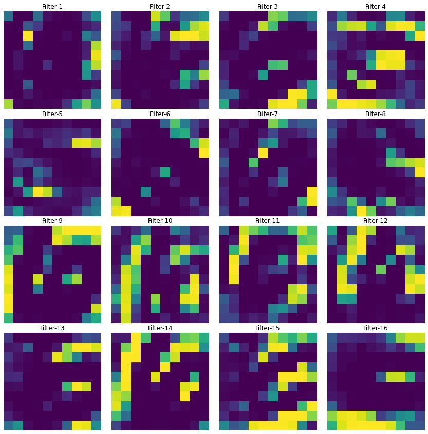

<h1 align="center">
  LeNet-5-Visualization
</h1>
 <h3 align="center">
  Visualizing each layer output of LeNet-5 model trained on mnist data(digits)
</h3>

## Architecture

<a href='http://yann.lecun.com/exdb/publis/pdf/lecun-98.pdf'>Official Paper</a>

  
  

  
  
## Model Summary

Trained on mnist data
#### Performance
  loss: 0.0189 - accuracy: 0.9938 - val_loss: 0.0562 - val_accuracy: 0.9868
#### Summary
  

## Visualization

#### Original Image
 
 
#### Layer-1(conv2d)
 
 
 #### Layer-2(max_pooling2d)
 
 
 #### Layer-3(conv2d_1)
  
 
 #### Layer-4(max_pooling2d_1)
  
 
 ### Try it yourself on different digits on google colab or on local system by using checkpoint.zip and <a href='https://github.com/ishanExtreme/LeNet-5-Visualization/blob/master/LeNet_5.ipynb'>LeNet-5.ipynb</a> in the repository

